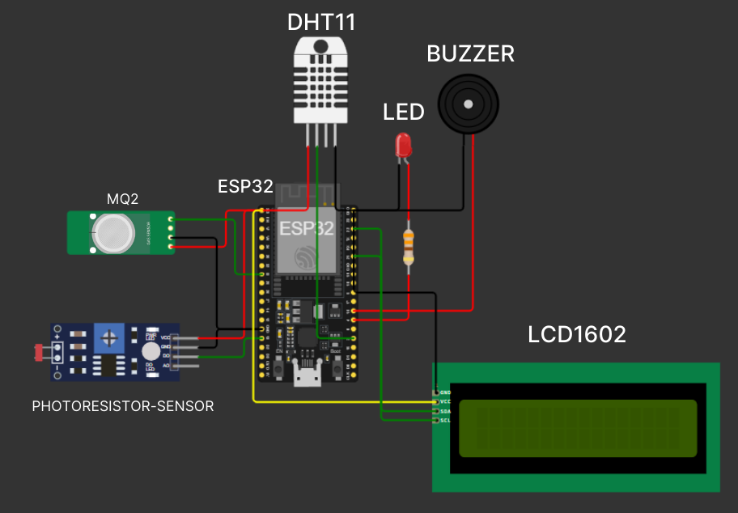

# Gas-Level-Monitoring-System-ESP32-Blynk
This project implements an Internet of Things (IoT) Gas Level Monitoring System using an ESP32 microcontroller, which is capable of detecting combustible gases (like LPG, Methane, Propane), measuring ambient temperature and humidity, and detecting fire/flame.


-----

# Gas Level Monitoring System ♨️🔥

This project implements an **Internet of Things (IoT) Gas Level Monitoring System** using an **ESP32** microcontroller. The system is designed to detect combustible gases (MQ-2), measure ambient temperature and humidity (DHT11), and detect fire/flame (Photoresistor).

It uses the **Blynk** platform for real-time remote monitoring, visualization, and sending alerts via a smartphone application or web dashboard. A local **LCD** and **Buzzer/LED** provide immediate, on-site alarms.

-----

## 🛠️ Components and Wiring

The system is built around an ESP32, integrating several key sensors and actuators.

### Hardware Components

| Component | Function | Connection Pin |
| :--- | :--- | :--- |
| **ESP32 Dev Module** | Main microcontroller and Wi-Fi capability | N/A |
| **MQ-2 Gas Sensor** | Detects combustible gas and smoke levels | **GPIO 34** (Analog) |
| **Photoresistor Sensor** | Detects the infrared light of a flame | **GPIO 5** (Digital) |
| **DHT11 Sensor** | Measures ambient Temperature and Humidity | **GPIO 4** (Data) |
| **LCD1602 (I2C)** | Displays sensor readings and system status locally | I2C (SDA/SCL) |
| **Buzzer** | Provides an audible alarm | **GPIO 2** (Digital) |
| **LED** | Provides a visual alarm | **GPIO 15** (Digital) |

### Wiring Diagram



-----

## ☁️ Cloud Monitoring with Blynk

The project uses the **Blynk** platform for remote monitoring and control.

### Virtual Pin Assignments

Data is sent to the following Blynk Virtual Pins:

| Virtual Pin | Data Sent | Description | Alarm Logic |
| :---: | :--- | :--- | :--- |
| **V0** | `gasValue` (0-100%) | Gas Level percentage | N/A |
| **V1** | `flameDetected` (1 or 0) | Flame presence status | 1 = Detected, 0 = None |
| **V2** | `temperature` (°C) | Temperature reading from DHT11 | N/A |
| **V3** | `humidity` (%) | Humidity reading from DHT11 | N/A |
| **V4** | Gas Alarm Status | **LED Widget**: $\text{ON}$ if Gas $\ge 50\%$ |
| **V5** | Flame Alarm Status | **LED Widget**: $\text{ON}$ if Flame Detected |
| **V6** | `lcdContentForBlynk` | String mirror of the local 16x2 LCD display | N/A |

### Alarm and Notification Logic

| Trigger Condition | Local Response | Remote Alert (Blynk Log Event) |
| :--- | :--- | :--- |
| **High Gas Level** (`>= 50%`) | Buzzer $\text{ON}$, LED $\text{ON}$ | `gas_alert` |
| **Flame/Fire Detected** | Buzzer $\text{ON}$, LED $\text{ON}$ | `fire_alert` |
| **High Temperature** (`> 40.0 °C`) | None (Monitoring only) | `temp_alert` |

**Note:** All Blynk notifications are throttled to a minimum of **60 seconds** (`notificationDelay`) between consecutive alerts of the same type.

-----

## 💻 Getting Started

### 1\. Dependencies

Install the following libraries in your Arduino IDE:

  * **Blynk Library**
  * **DHT sensor library**
  * **LiquidCrystal I2C**
  * Standard **Wire** and **WiFiClient** libraries.

### 2\. Configuration

Before compiling, **update the following credentials** in the Arduino sketch:

```cpp
// Blynk credentials - MUST BE BEFORE INCLUDING LIBRARIES
#define BLYNK_AUTH_TOKEN "N_a08cz6N5Glqv_ZMdY_iIQFe6MvnHN7" // <-- Replace with your own token if necessary

//WiFi credentials
char ssid[] = "asparagus"; // <-- Replace with your Wi-Fi SSID
char pass[] = "235235235"; // <-- Replace with your Wi-Fi Password
```

### 3\. Execution

1.  Select the **ESP32 Dev Module** and the correct **Port**.
2.  Upload the code.
3.  The system will attempt to connect to Wi-Fi and Blynk, displaying status messages on the LCD.
4.  Once connected, the `sendSensorData()` function runs every **2 seconds** to read sensors, check alarms, update the local LCD (which rotates display mode), and send data to Blynk.

-----

## 🌐 Wokwi Simulation

You can test and modify this project instantly using the Wokwi online simulator without needing physical hardware.

➡️ **[Run the Gas Monitoring System in Wokwi](https://wokwi.com/projects/426551133431211009)**

-----

## 📸 Project Images

*Add your project images here.*
